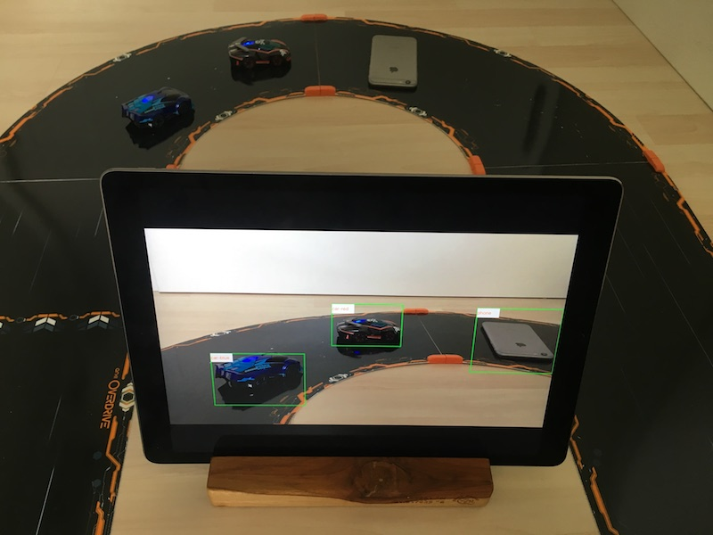

# TensorFlow Object Detection for Anki Overdrive Cars

to be done




## Setup of the iOS App with the trained Model

Compile Tensorflow 1.9.0 on MacOS:

```bash
$ brew install automake libtool
$ git clone https://github.com/tensorflow/tensorflow
$ cd tensorflow
$ git checkout v1.9.0
$ export ANDROID_TYPES="-D__ANDROID_TYPES_FULL__"
$ tensorflow/contrib/makefile/build_all_ios.sh
$ git clone https://github.com/nheidloff/object-detection-anki-overdrive-cars.git
```

I ran into issues. Check out the [workaround](https://github.com/tensorflow/tensorflow/issues/18356) that I used.

Open the cloned iOS project in Xcode and edit the tensorflow.xconfig file to point to the folder where you cloned the TensorFlow repo, for example:
TENSORFLOW_ROOT=/Users/nheidloff/Development/tensorflow

Sign the app, connect an iOS device and launch the app.


## Training your own Model

### 1) Development Environment Setup
 
```bash
$ git clone https://github.com/nheidloff/object-detection-anki-overdrive-cars.git
$ cd object-detection-anki-overdrive-cars
$ my_project_dir=$(pwd)
$ export PROJECT_DIR=$my_project_dir
$ docker build -t tensorflow-od .
$ cd $PROJECT_DIR/volume/data
$ wget http://download.tensorflow.org/models/object_detection/ssd_mobilenet_v2_coco_2018_03_29.tar.gz
$ tar xvzf ssd_mobilenet_v2_coco_2018_03_29.tar.gz
$ cp -R ${PROJECT_DIR}/data ${PROJECT_DIR}/volume/data
```

## 2) Labelling of Images and Creation of TFRecords

Use [labelImg](https://github.com/tzutalin/labelImg) to create annotations.

Create [label_map.pbtxt](data/label_map.pbtxt).

**Create TFRecords**

```bash
$ docker run -v $PROJECT_DIR/volume:/tensorflow/models/research/volume -it --rm tensorflow-od bash
```

```bash
$ cd volume
$ python create_tfrecord.py 
$ exit
```


## 3) Train the Model 

**3a) Train the model locally**

```bash
$ docker run -v $PROJECT_DIR/volume:/tensorflow/models/research/volume -it --rm tensorflow-od bash
```

```bash
$ cd volume
$ python model_main.py --model_dir=./training --pipeline_config_path=ssd_mobilenet_v2_coco.config --num_train_steps=100  --alsologtostderr
$ exit
```

**3a) Train the model on the IBM Cloud**

Replace 'nheidloff' with your Dockerhub account name.

```bash
$ cd $PROJECT_DIR
$ docker build --file DockerfileCloud -t nheidloff/train-od .
$ docker push nheidloff/train-od
```

Open the Kubernetes Dashboard and create a new application pointing to 'nheidloff/train-od'.

In the Kubernetes Dashboard open a terminal and invoke these commands:

```bash
$ cd volume
$ python model_main.py --model_dir=./models/train --pipeline_config_path=ssd_mobilenet_v2_coco.config --num_train_steps=18000 --alsologtostderr
```

To copy the files to a local directory, run these commands. Replace 'train-56cfd5b9f-8x6q4' with your pod name.

```bash
$ cd $PROJECT_DIR/volume/training
$ kubectl get pods
$ kubectl exec train-56cfd5b9f-8x6q4 -- ls /tensorflow/models/research/volume/models/train
$ kubectl cp default/train-56cfd5b9f-8x6q4:/tensorflow/models/research/volume/models/train .
```


## 4) Save the Model 

```bash
$ docker run -v $PROJECT_DIR/volume:/tensorflow/models/research/volume -it --rm tensorflow-od bash
```

Replace '100' with the number of your training runs

```bash
$ cd volume
$ python export_inference_graph.py \
    --input_type=image_tensor \
    --pipeline_config_path=ssd_mobilenet_v2_coco.config \
    --trained_checkpoint_prefix=./training/model.ckpt-100 \
    --output_directory=frozen-graph/
$ exit
```


## 5) Test the Model 

**Notebook**

Add test images to $PROJECT_DIR/volume/testing/images and name them 'image1.jpg' and 'image2.jpg'.

```bash
$ cp $PROJECT_DIR/volume/frozen-graph/frozen_inference_graph.pb $PROJECT_DIR/volume/testing/
$ cp $PROJECT_DIR/volume/data/label_map.pbtxt $PROJECT_DIR/volume/testing/
$ docker build --file DockerfileNotebook -t tensorflow-od-test .
$ docker run -v $PROJECT_DIR/volume:/tensorflow/models/research/volume -it -p 8888:8888 --rm tensorflow-od-test
```

**Tensorboard**

```bash
$ cd $PROJECT_DIR/volume/training
$ docker run -d -p 6006:6006 -v $(pwd):/logs --name my-tf-tensorboard volnet/tensorflow-tensorboard
```


## 6) Setup of the iOS App

See steps above.

```bash
$ cp $PROJECT_DIR/volume/frozen-graph/frozen_inference_graph.pb $PROJECT_DIR/ios/models/
$ cp $PROJECT_DIR/volume/data/label_map.pbtxt $PROJECT_DIR/ios/models/label_map.txt
```

Sign the app, connect an iOS device and launch the app.